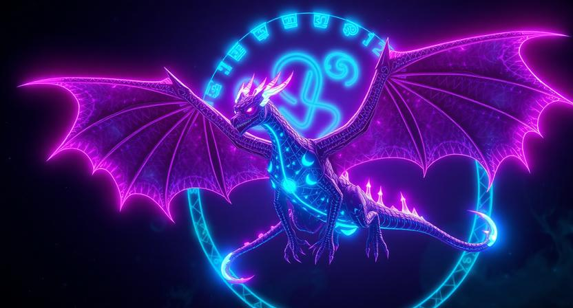

  

<h1 align="center">🐉 VVyvernX</h1>
<h3 align="center">Visual × Code × Creation</h3>

A creator-engineer building the <b>Kamiverse</b> 
Anime aesthetics · Software Engineering · AI Systems

  

---

## 🧠 About Me

- 🎨 Visual creator with an anime-tech aesthetic  
- 💻 Developer focused on clean systems & scalability  
- 🤖 Exploring AI, Generative AI & creator tools  
- 🌌 Building a personal universe called **Kamiverse**

> *I don’t just write code — I design worlds.*

---

## 🛠 Tech Arsenal

### 💻 Programming

### 🎨 Design & Creation

### ⚙️ Tools

---

## 🌌 Kamiverse Projects

🚧 *Currently evolving…*

- 🐉 **Kamiverse Core** — Anime-inspired digital universe  
- 🤖 **AI Experiments** — Claude-style & rule-based systems  
- 🌐 **Web Systems** — Frontend & backend architectures  
- 🎥 **Dev Logs** — Art × Code × Storytelling  

> *Each repository is a fragment of a larger universe.*

---

## 📊 GitHub Stats

  

  

---

## 🧿 Philosophy

- Code is **creation**, not just syntax  
- Design is **storytelling**
- AI should **augment**, not replace  
- Consistency > Motivation  
- Evolution is mandatory  

---

## 🔗 Connect

- 🎥 YouTube: **VVyvernX** *(coming soon)*  
- 🎨 Creator Identity: **vi.ck**  
- 🌌 Universe: **Kamiverse**

  <i>“Build quietly. Evolve constantly.”</i>

